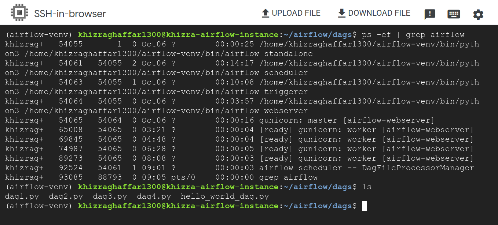
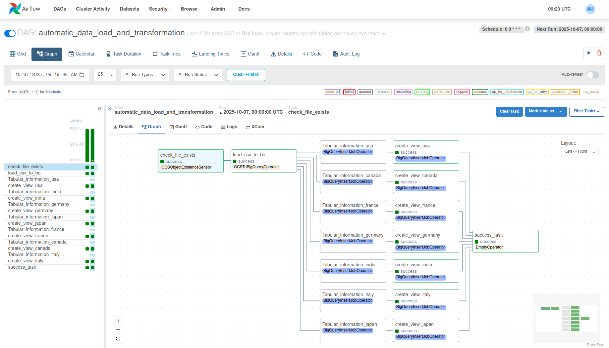

## Global Health Data ELT and Reporting Pipeline

### Project Overview

This project demonstrates how to build a scalable ETL pipeline using Airflow on Google Cloud.  
- **Airflow** orchestrates the workflow tasks (sensors, data load, transformations, views).  
- **Google Cloud Storage (GCS)** stores the raw CSV files.  
- **BigQuery** stores staging, transformed tables, and reporting views.  
- **Looker Studio** (formerly Data Studio) consumes BigQuery views for visualization and reporting. 
- **Kaggle Dataset:** The raw CSV can also be downloaded from Kaggle. 

The DAG (`data_transformation.py`) performs the following tasks:  
1. Checks if a CSV file exists in GCS.  
2. Loads the CSV into a staging BigQuery table.  
3. Creates country-specific tables in a transformation dataset.  
4. Creates reporting views filtered on vaccine availability.  
5. Signals success with a dummy task after all transformations.

---

### Prerequisites

- Google Cloud Project with BigQuery datasets created:  
  - `staging_dataset`  
  - `transform_dataset`  
  - `processing_dataset`  
- A GCS bucket containing your CSV file (`global_health_data.csv`) **or download it from Kaggle**:  
  - Kaggle Dataset: [Global Health Statistics](https://www.kaggle.com/datasets/malaiarasugraj/global-health-statistics)  
---

### Project Structure
```plaintext
etl_airflow/
│
├── dags/                            # Airflow DAGs directory
│   ├── data_transformation.py       # DAG for transforming CSV data into country-specific tables and views
│   ├── gcs_to_bq_sensor.py          # Optional helper DAG or operator for GCS to BigQuery sensor
│   ├── hello_world_dag.py           # Sample/test DAG to verify Airflow setup
│   └── processing_gcs_to_bq.py      # Script or DAG for loading GCS data to BigQuery
│
├── data/                             # Local dataset storage (should not be pushed to GitHub)
│   └── global_health_data.csv       # Raw CSV file (added to .gitignore)
│
├── Images/                      # Screenshots for documentation
│   ├── airflow_graph.png             # DAG Graph view in Airflow UI
│   └── airflow_status.png            # Airflow processes status (ps -ef | grep airflow)
│
├── requirements.txt                  # Python dependencies for the project
└── README.md                         # Project overview, setup instructions, and DAG explanation
```

---
### Steps to Run

1. Create and connect to a GCP VM
```bash
# Create a VM instance in GCP via Console or gcloud CLI
# SSH into your VM
gcloud compute ssh <VM_NAME> --zone <ZONE>
(e.g. gcloud compute ssh khizra-airflow-instance --zone=northamerica-northeast1-c)
```

2. Set up Python environment
Create a virtual environment
```bash
python3 -m venv airflow-venv
```
Activate the virtual environment
```bash
source airflow-venv/bin/activate
```

3. Install dependencies
```bash
pip install -r requirements.txt
```

4. Initialize and start Airflow
Standalone mode (quick setup, includes scheduler & webserver):
```bash
airflow db init
airflow standalone
```

Production setup (separate scheduler, webserver, triggerer):
```bash
airflow scheduler &
airflow webserver -p 8080 &
airflow triggerer &
```

Stop Airflow processes
```bash
pkill -f "airflow standalone"
pkill -f "airflow"
```

```bash
# Check again to ensure all are gone
ps -ef | grep airflow
```

Run Airflow in background
```bash
nohup airflow standalone > airflow.log 2>&1 &
```
Use Default or Create Airflow user
```bash
airflow users create \
  --username admin2 \
  --firstname Admin \
  --lastname Two \
  --role Admin \
  --email admin2@example.com \
  --password 'check'
```

5. Connecting local system/VSCode to GCP VM
```bash
gcloud compute ssh khizra-airflow-instance --zone=northamerica-northeast1-c

# Set GCP project to use
gcloud config set project <GCP_PROJECT_ID>
(e.g. gcloud config set project sales-analytics-473222)

# Copy DAG to remote VM
scp data_transformation.py khizra@35.203.116.146:/home/khizraghaffar1300/airflow/dags/
```

6. Place the DAG
```bash
# Copy data_transformation.p into the dags folder
cp data_transformation.p ~/airflow/data_transformation.py/
```

7. Access Airflow Web UI
```bash
Open in browser:
http://<VM_EXTERNAL_IP>:8080
```
Enable your DAG and trigger runs manually or let the scheduler run as per DAG schedule.

8. Monitor DAGs
```bash
Check Airflow processes
ps -ef | grep airflow
```
- View logs via Airflow UI or local log files in ~/airflow/logs/.

**Airflow Graphical Data Processing**

### DAG Workflow

The DAG (`automatic_data_load_and_transformation`) contains the following tasks:

1. **`check_file_exists`**  
   - Sensor task that verifies the existence of the CSV file in GCS.  
   - Waits up to 5 minutes, checking every 30 seconds.

2. **`load_csv_to_bq`**  
   - Loads the CSV from GCS into the staging BigQuery table.  
   - Handles irregularities in CSV (jagged rows, unknown values).  

3. **Country-specific Table Creation (`create_table_<country>`)**  
   - Dynamically creates a table for each country based on the staging data.  
   - Allows granular analysis per country.  

4. **Country-specific View Creation (`create_view_<country>`)**  
   - Generates views with selected columns and filters, e.g., rows where `Availability of Vaccines Treatment = False`.  
   - Enables easy reporting in Looker Studio without modifying underlying tables.  

5. **`success_task`**  
   - A dummy task indicating that all tasks have completed successfully.  


### Airflow Components (Short Explanation)

- **Scheduler:** Continuously monitors DAGs and triggers tasks as per schedule (e.g. The DAG runs daily at midnight: 0 0 * * *).  
- **Webserver:** Provides the UI to manage and monitor DAGs.  
- **Triggerer:** Handles asynchronous tasks such as sensors or external triggers.  
- **Standalone mode:** Runs scheduler, webserver, and triggerer in a single process (good for testing).  
- **Tasks & DAGs:** DAGs define workflows; tasks define steps in the workflow.  


### Report Use Case

The DAG prepares data for Looker Studio dashboards that display:

- Country-level disease prevalence and incidence
- Vaccination availability metrics
- Trends over years

**LockerStudio Report - Global Health Data Insights:**
- This allows stakeholders to easily understand health trends and make data-driven decisions.


### Importance of Airflow, GCP, and Looker Studio

- **Airflow:** Automates data workflows, reducing manual intervention and errors.  
- **GCP (GCS & BigQuery):** Scalable, serverless cloud storage and analytics platform.  
- **Looker Studio:** Converts raw and transformed data into interactive visual reports for insights.
